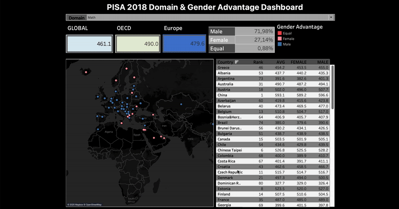

# PISA 2018 Interactive Dashboard – Tableau Prototype

This project visualizes international student performance from the PISA 2018 dataset, with a focus on:
- Greece’s position relative to other countries  
- Gender gaps across subjects

Built using **Tableau**, this dashboard offers fully interactive exploration via maps, filters, and dynamic tables.

---
## Dashboard Demo

## MAP VIEW – Country Performance

### Configuration
- **Type**: Symbol Map
- **Geography**: Country
- **Color Encoding**: Gender advantage  
  - 🔵 Blue = Male advantage  
  - 🔴 Red = Female advantage  
  - ⚪ Gray = Equal performance

### Interaction
- Hovering over a country reveals:
  - Country name  
  - Gender advantage  
  - Average score  
  - Gender gap  
- Navigation: Zoom and pan supported  
- Clicking a country highlights its row in the table (yellow), linking geography and performance data

---

## KPI BOXES – Regional Averages

- Displays average scores by region:
  - **Global**, **OECD**, and **Europe**
- Updates dynamically with selected domain
- Greece is highlighted in blue if it appears in the top 15 for the selected domain

---

## LEGEND & PERFORMANCE BREAKDOWN

- **Gender Advantage Legend** shows which gender outperforms in a given domain
- Summary table shows:
  - % of countries where each gender had an advantage
  - Hover reveals countries contributing to that percentage

---

## TABLE VIEW – Detailed Scores

- Lists countries by:
  - **Rank**
  - **Average score**
  - **Female score**
  - **Male score**
- Designed for direct comparison across gender and region
- Hover for detailed tooltips
- Highlighted country row aligns with map selection

---

## CONTROLS & FILTERS

- **Domain Selector**: Choose from all subjects or Global Competence
- Affects all KPIs, maps, and tables
- Defined metrics (Rank, Average) enhance score/value comparisons

---

## INTERACTIVITY SUMMARY

| Element                 | Description                                                                 |
|-------------------------|-----------------------------------------------------------------------------|
| Map                     | Colored by gender advantage; clickable for table highlighting               |
| KPI Boxes               | Show average scores for Global/OECD/Europe regions                          |
| Legend                  | Explains gender advantage color coding                                      |
| Summary Table           | Displays % advantage and contributing countries                             |
| Score Table             | Displays country ranks and gender-specific performance                      |

---

## Link to Source
- [GitHub – Tableau Workbook](https://github.com/e-panourgia/vizRTableau/blob/main/tableau/pisa-domain-gender-advantage.twbx)
- [`pisa_dynamic_dashboard_with_tableau.pdf`](reports/pisa_dynamic_dashboard_with_tableau.pdf) – Tableau dashboard summary and screenshots
